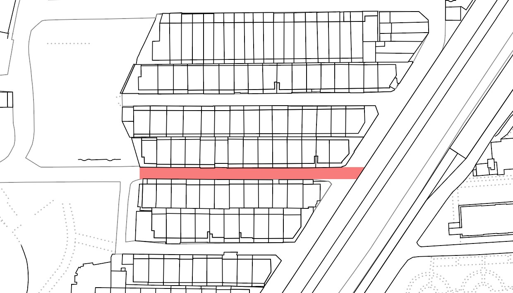
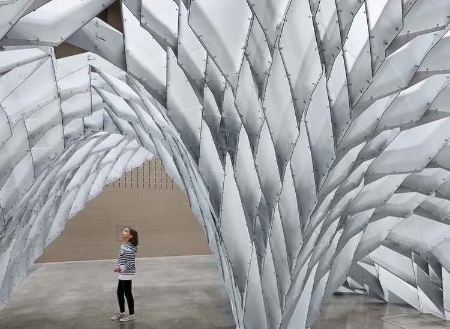
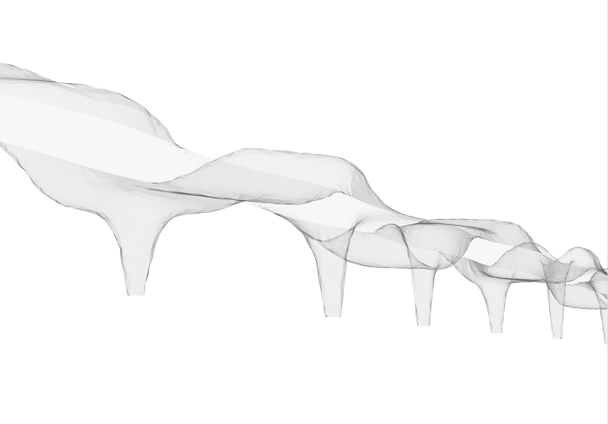
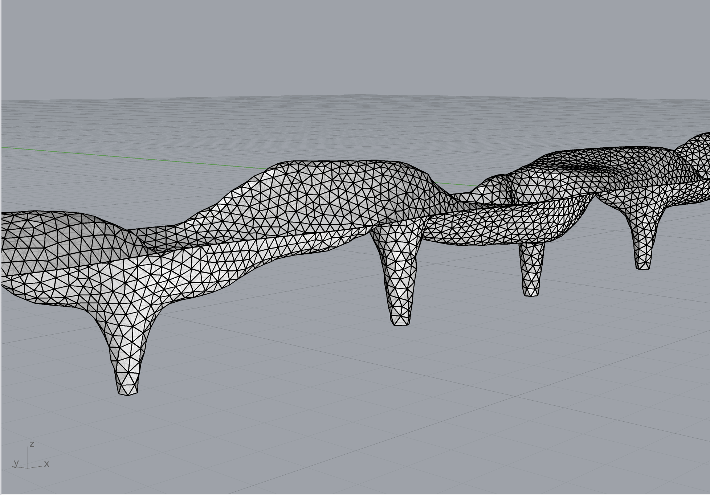
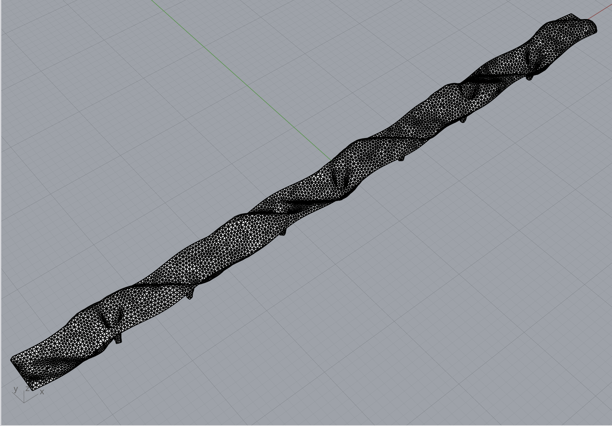
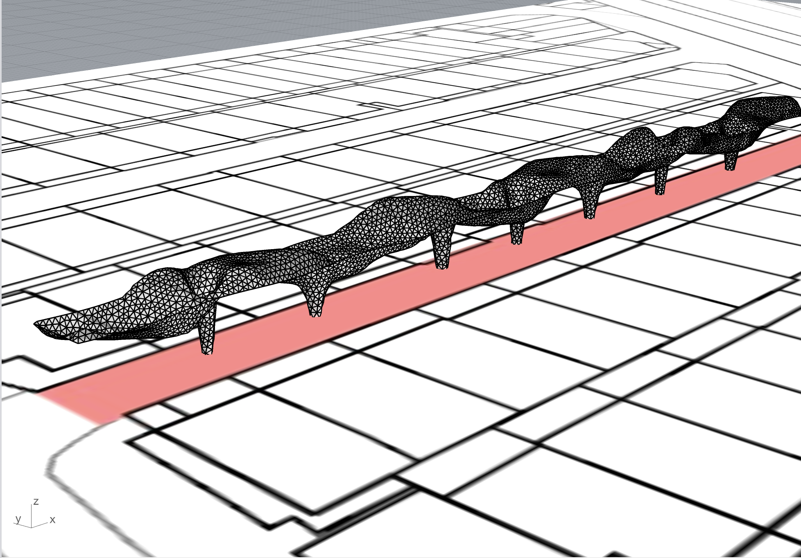

#設計目標：

本設計旨在配合大二設計的公園與綠園道主題，在城市肌理中創造一條兼具結構美學與環境融合性的行人與居民連接廊道。

#基地選擇：

地點： 台南市北區實踐街103巷25弄。

功能定位： 該廊道選擇此基地，是為了串聯永祥公園與台南未來綠園道，作為城市綠色網絡中的一個關鍵節點，提供一個有機的、遮蔭的、令人愉悅的通行空間。



#參數化生成邏輯：從概念到形態

本專案的形態生成，是基於對既有參數化設計的參考與創新，核心是透過程式碼迭代，從 $90m \times 5m$ 的二維邊界，演化出一個三維的、具有結構感的有機拱頂。

1. 形態啟發：Caret 6 (SXSW) 與課堂範例 Mesh Pavilion

參考依據： 形狀參考自 Caret 6 (SXSW) 等參數化網格涼亭的自由曲面形態。

方法： 透過調整基礎的 Mesh Pavilion 程式碼，將網格邊界從封閉結構，轉化為一條極長且單向延伸的廊道，並調整開口與曲面細節，形成具有方向性的「參數化拱頂」。



2. 有機邊界與廊道定型

尺寸與比例： 程式碼定義了 $L=90.0m, W=5.0m$ 的極端長寬比，精準對應廊道的尺度。

邊界波浪： 使用三頻率疊加的三角函數 (get_organic_offset)，賦予廊道邊界自然的、大尺度的起伏，避免生硬的直線邊緣，增強與環境的對話感。$$\text{offset}(x) = 1.2 \sin(\dots) + 0.5 \sin(\dots) + 0.2 \cos(\dots)$$結構孔洞： 沿 $90m$ 長度均勻生成 $7$ 個圓形孔洞。這些孔洞不僅是鏤空，它們在後續的頂點操縱中被定義為承重支柱的基礎。

3. 結構收束與拱腳固定

目標： 解決自由曲面與地面的連接問題，確保結構穩定性。

收束邏輯： 程式碼的核心收束邏輯將孔洞邊緣的頂點從初始半徑 ($1.0 \sim 1.4$) 強制向內推移至更小的目標半徑 ($0.45 \sim 0.55$)。

物理模擬： 這些收束後的點被固定在 $Z = -5.0m$ 的預設走道高程，模擬柱子在結構底部的收束和落地，形成了拱頂的穩定基座。

4. 形態迭代與天花板生成

迭代核心： 採用拉普拉斯平滑鬆弛 $(220 \text{ 步})$ 進行形態優化。這確保了網格的平滑度和結構的連續性。

拱頂形態驅動： 在鬆弛過程中，疊加了一個大型波浪函數作為外部力場，持續影響頂點的 $Z$ 座標。$$\text{wave} = 2.0 \sin(0.12x + 0.4y) + 0.6 \cos(0.3x)$$這個波浪函數是生成高低起伏的有機拱頂的直接原因，模擬了自然界的動態曲面。

結果： 內部網格在被拉伸、平滑和固定腳點的共同作用下，形成了具有厚度感和流動感的拱頂結構。

5. 網格優化與可視化

網格重劃： 最終使用 Remeshing 技術統一網格邊長 ($0.7m$)，提高模型的製造可行性和視覺質感。

Z 軸色彩分析： 根據頂點的 $Z$ 座標賦予顏色，不僅美觀，更直接展示了拱頂的高低起伏和結構受力分佈趨勢（通常較高的部分壓力或拉力變化較大）。

＃環境安裝

1.下載Aniconda/Miniconda
    
Miniconda: [下載](https://www.anaconda.com/docs/getting-started/miniconda/main)
Aniconda:[下載](https://www.anaconda.com/)

2.安裝COMPUS資料庫

開啟Anaconda Powershell Prompt (miniconda3) (Windows), or Powershell (Windows), or Terminal (macOS).

首先，我們將 conda-forge 新增為 **conda** 取得套件的來源（channel）。這個設定在每台電腦上只需要做一次即可。

```python
conda config --add channels conda-forge
```

如果該指令沒有回傳任何內容，表示該 channel 已成功加入。

接下來，建立一個新的環境，並且在此**明確指定 Python 版本為 3.9.10**，這個版本是 **Rhino 8 隨附的 Python 版本**。

```python
conda create -n DCCG_FINAL_PROJECT python=3.9.10 compas pyside6
```

回答**y**以繼續執行

> （註：截至 **2025 年 10 月**，需要**明確安裝 pyside6**，才能讓 **compas_viewer** 透過 pip 正確安裝。）

完成後，請啟用（activate）該環境，這樣我們才能在其中安裝套件。


```python
conda activate DCCG_FINAL_PROJECT
```
   

當環境被啟用後，**環境名稱會顯示在指令提示字元前方**。在這個例子中是 **(DCCG_FINAL_PROJECT)**。接著請繼續安裝 **COMPAS_viewer**：

```python
pip install compas_viewer
```

這些步驟可能需要一點時間。過程中你可能會看到像這樣的警告，這是因為我們使用的某些模組尚未是穩定版本。當系統提示時，請輸入 y 以繼續。     

COMPUS安裝完成。

3.安裝COMPUS擴充

開啟你的終端機（Terminal）、或 Anaconda Powershell Prompt，或任何可以執行 conda 指令的命令列介面。

啟用你的環境，更新已安裝的套件，並安裝所需的套件。

```python
conda activate DCCG_FINAL_PROJECT
```
```python
conda update --all
```
```python
conda install pandas libpysal contextily geopandas compas_cgal
```

現在可以執行程式了！

#成果




